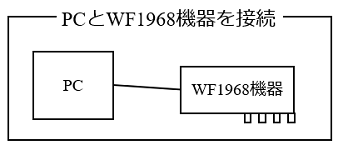

## 1_PCとWF1968機器を接続



### 1.1_接続の基本

- **visautils**パッケージを使って，WF1968機器を制御するには，最初に，WF1968機器と接続します．
- WF1968機器と接続するPythonスクリプトは，下記のようになります．但し，**xxxxxxxx**の部分は，WF1968機器毎に異なる番号となります．WF1968機器の個別の番号を調べるには，本体の「MENU」→「Utility」→「Remote」を選択して，Interface選択欄を"USB"に選択すると画面表示されます．WF1968機器とUSB接続する場合は，この設定項目を"USB"に選択して下さい．

```python
from visautils import visaWF1968

WF1968 = visaWF1968.visaWF1968("USB0::0x0D4A::0x003A::xxxxxxx::INSTR")
WF1968.open()
```

- WF1968機器の個別の番号を調べて，上記のPythonスクリプトを作成したら，実行してみて下さい．エラーメッセージが表示されなければ，WF1968機器と問題なく接続できています．
- 最初の，WF1968 = visaWF1968.visaWF1968(...)行は，visaWF1968モジュールのvisaWF1968クラスインスタンスを生成しています．この段階では，まだWF1968機器と接続していません．WF1968クラスインスタンスは，WF1968機器とSCPIコマンドを送受信するためのものです．visautilsパッケージでは，open()関数とreset()関数のみ使います．
- 次の，WF1968.open()行で，WF1968機器と接続します．

### 1.2_エラー処理を追加する

- WF1968機器と接続するPythonスクリプトは，基本的には上記のコマンドのみでOKなのですが，接続できない時の処理を追加した方が良いでしょう．
- ためしに，WF1968機器の電源をOFFにした状態で，上記のPythonスクリプトを実行してみて下さい．何やら，エラーメッセージが表示されると思います．これは，WF1968機器に接続しようとしたが，接続出来なかったことを意味しています．

- visautilsパッケージでは，WF1968機器と接続出来なかった時は，例外を発生します．Pythonでの例外処理を理解する必要はありません．下記に示すPythonスクリプトと同じ記述で，WF1968機器と接続出来なかった時は，画面にメッセージを表示して，Pythonスクリプトの実行を終了することができます．

```python
imort sys
from visautils import visaWF1968

try:
  WF1968 = visaWF1968.visaWF1968("USB0::0x0D4A::0x003A::xxxxxxx::INSTR")
  WF1968.open()
except:
    print("Can't connect to WF1968\n")
    sys.exit(0)
```

### 1.3_ENV_WF1968_RESNAME環境変数を使う

- 上記で紹介した方法は，WF1968機器の接続番号をPythonスクリプトに直接記述する方法です．この方法だと，WF1968機器を交換する毎に，該当する箇所を記述し直す必要が出てきます．また，複数のメンバーで，共通のPythonスクリプトを共有するケース（個人毎に別のWF1968機器を使っているケース）でも，同様に，該当する箇所を記述し直す必要が出てきます．
- これに対し，**ENV_WF1968_RESNAME**環境変数に，WF1968機器の接続番号を設定しておき，Pythonスクリプト内では，接続番号の代わりに，このENV_WF1968_RESNAME文字を記述することで，環境変数に設定されている接続番号を使うこともできます．

- 下記に示す，ENV_WF1968_RESNAME環境変数を使う方法だと，WF1968機器を交換しても（複数のメンバー毎に別のWF1968機器を使うケースでも），環境変数の設定を変更するだけで，Pythonスクリプトは修正せずに，同じPythonスクリプトを使うことができます．

```python
from visautils import visaWF1968

WF1968 = visaWF1968.visaWF1968("ENV_WF1968_REANAME")
WF1968.open()
```