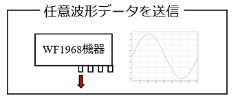
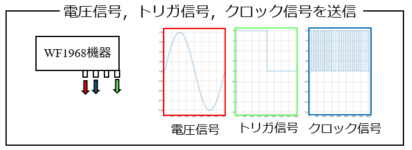
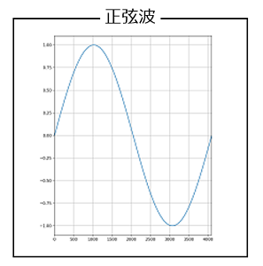
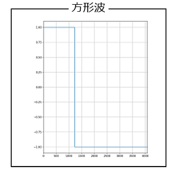
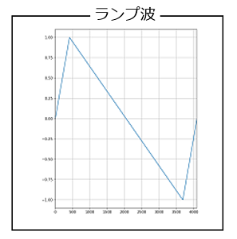

## 1_funcgenクラスインスタンスの初期設定まで



- **visautils**パッケージでは，**mesDevice**モジュールの**funcgen**クラスを使ってWF1968機器を制御します．
- mesDeviceモジュールのfuncgenクラスの初期設定までのPythonスクリプトは，下記のようになります．
- 各変数は次の値を設定します．

| 変数 | 値 | 単位 |


```python
from visautils import mesDevice, visaWF1968

freq     = 50
ndata    = 4096
ex_range = 2
amp_gain = 100
fg_tch   = 2
fg_clch  = 1

WF1968 = visaWF1968.visaWF1968("ENV_WF1968_RESNAME")
WF1968.open()

WF1968.reset()
funcgen = mesDevice.funcgen(freq, ndata, ex_range, amp_gain, fg_tch, fg_clch)
funcgen.initial_setting(WF1968)
```

- 最初に，WF1968クラスインスタンスを生成し，open()関数でWF1968機器と接続します．
- 次の，WF1968.reset()行は，WF1968機器のリセットコマンドを実行しています．これは，前回の測定で残っている設定項目を初期化するのに使います．必ずしも必要ではありませんが，前回の測定の設定項目が残ったままの状態では，初期設定できないケースがあるので，初期設定を行う前にリセットを実行するのが良いでしょう．
- さらに，送信する電圧信号の周波数などの初期設定項目を引数として，mesDeviceモジュールのfuncgenクラスを生成します．
- 最後に，WF1968クラスインスタンスを引数として，funcgenクラスインスタンスのinitial_setting()関数を実行することで，WF1968機器を制御するためのfuncgenクラスインスタンスの初期設定が完了しました．

### 1.1_トリガ信号およびクロック信号を送信



- visautilsパッケージは，WF1968機器の機能を利用することで，サブチャネルから，**トリガ信号**および**クロック信号**を出力することができます．
- funcgenクラスインスタンスを生成する際に，**fg_tch**引数と**fg_clch**引数にサブチャネル番号を指定すると，それぞれ，トリガ信号およびクロック信号が出力されます．
- 但し，fg_clch引数で指定するクロック信号は**1**サブチャネルのみ有効です（WF1968機器の仕様）．
- トリガ信号およびクロック信号を，サブチャネルから出力しない場合は，それぞれの引数に**None**を設定して下さい．但し，サブチャネルにケーブルを接続しないなど，サブチャネルから電圧信号を送信した状態でも問題なければ，Noneを設定しなくても良いです．

## 2_任意波形データの生成

- visautilsパッケージでは，WF1968機器から送信する電圧信号は，**配列形式**の**任意波形データ**を使います．
- 配列形式の任意波形データは，**4096～1048577までの2の累乗個**（4096, 8192, 16384, 32768, 65536, 131072, 262144, 524288, 1048576）のデータ数のみ有効です（WF1968機器の仕様）．
- 任意波形データは，**numpy配列**であれば利用者が自由に作成できますが，正弦波，方形波，ランプ波の3つの種類の波形データに関しては，**waveData**モジュールのクラス関数にパラメータを引数として生成することができます．

### 2.1_任意波形データの注意点
- ここで注意すべき点があります．任意波形データは，送信する電圧信号そのものではありません．例えば，振幅値2[V0p]の正弦波を送信する任意波形データのケースを考えます．
- ここで重要なのは，funcgenクラスインスタンスの生成時に，ex_range引数で設定した出力電圧レンジの値です．任意波形データは，この出力電圧レンジに対する相対的な値を使って生成します．
- 例えば，振幅値2[V0p]の電圧信号を出力したいケースにおいて，ex_range引数で2[V0p]を設定しているのなら，任意波形データは振幅値1[V0p]の正弦波のデータとして生成し，ex_range引数で4[V0p]を設定しているのなら，任意波形データは振幅値0.5[V0p]の正弦波のデータを生成すればよいことになります．

### 2.2_waveDataモジュールを使った任意波形データの生成

- waveDataモジュールには，正弦波（sinWaveDataクラス），方形波（squareWaveDataクラス），ランプ波（rampWaveDataクラス）のnumpy配列を生成する関数を提供しています．
- いずれのnumpy配列も，**振幅値が1[V0p]の波形データ**となりますので，1[V0p]以外の振幅値の場合は，戻り値に振幅値をかけて下さい．

【正弦波の生成】



| 引数      | 型    | デフォルト値 | 説明            |
| --------- | ----- | ------------ | --------------- |
| **ndata** | int   |              | 1周期のデータ数 |
| **pha**   | float | 0            | 位相角 [deg]    |

```python
import waveData

ndata = 4096
sinwave  = waveData.sinWaveData.data(ndata)
sinwave2 = 0.5*waveData.sinWaveData.data(ndata) # 振幅値 0.5[V0p]の正弦波
```

【方形波の生成】



| 引数      | 型    | デフォルト値 | 説明            |
| --------- | ----- | ------------ | --------------- |
| **ndata** | int   |              | 1周期のデータ数 |
| **duty**          | float      |              | デューティ比 [%]                |
| **pha**   | float | 0            | 位相角 [deg]    |

```python
import waveData

ndata = 4096
dyty  = 30
squarewave  = waveData.squareWaveData.data(ndata, duty)
squarewave2 = 0.2*waveData.squareWaveData.data(ndata, duty) # 振幅値 0.2[V0p]の方形波
```

【ランプ波の生成】



| 引数      | 型    | デフォルト値 | 説明            |
| --------- | ----- | ------------ | --------------- |
| **ndata** | int   |              | 1周期のデータ数 |
| **symm**          | float      |              | シンメトリ比 [%]                |
| **pha**   | float | 0            | 位相角 [deg]    |

```python
import waveData

ndata = 4096
symm  = 20
rampwave  = waveData.rampWaveData.data(ndata, symm)
rampwave2 = 0.8*waveData.rampWaveData.data(ndata, symm) # 振幅値 0.8[V0p]のランプ波
```

### 2.3_任意波形データを作成する

- 任意波形データは，numpy配列のデータとして利用者自ら作成することができます．
- 下記のPythonスクリプトは，正弦波のnumpy配列を作成する例です．
- 注意点は，1周期の任意波形データは，最後の値が次の周期の最初の値を含まないようにしなくてはならないということです．例えば，位相0の正弦波の任意波形データは，0の値から始まりますが，最後の値は0にはなりません．データ数が4096個の場合の最後の値は0ではなく，$-1.533...\times 10^{-3}$となります．
- 下記のPythonスクリプトでも，numpyパッケージのlinspace()関数で，**endpoint=False**と指定することで，最後の値が次の周期の最初の値を含まないようにしています．

```python
import numpy as np

ndata = 4096
xs      = np.linspace(0, 1, ndata, endpoint=False)
ts      = 2*np.pi*xs
sinwave = np.sin(ts)
```
## 3_任意波形データの送信

- 任意波形データ（numpy配列データ）を引数として**send_arrayAW**()関数を実行すると，WF1968機器から任意波形データを電圧信号として送信します．
- 下記に，正弦波の任意波形データを送信するPythonスクリプトの例を示します．

```python
from visautils import mesDevice, visaWF1968, waveData

freq = 50
ndata = 4096
ex_range = 2
amp_gain = 1
fg_tch   = 2
fg_clch  = 1

WF1968 = visaWF1968.visaWF1968("ENV_WF1968_RESNAME")
WF1968.open()

WF1968.reset()
funcgen = mesDevice.funcgen(freq, ndata, ex_range, amp_gain, ft_tch, fg_clch)
funcgen.initial_setting(WF1968)

vs = waveData.sinWaveData.data(ndta)
funcgen.send_arrayAW(vs)
```

## 4_電圧レンジの変更

- WF1968機器から送信する任意波形データは，初期設定で電圧レンジを設定します．
- 但し，**visautisパッケージで設定するWF1968機器の電圧レンジは，バイポーラ電源で増幅後の電圧に対するレンジ**であることに注意して下さい．WF1968機器から送信する生の電圧信号の電圧レンジではありません．バイポーラ電源を接続しないケースにおいては，WF1968機器から送信する生の電圧信号の電圧レンジとなります．
- 初期設定で設定した電圧レンジを超える任意波形データを送信したい時は，**set_ex_range**()関数を使って，電圧レンジの再設定ができます．
- 下記に，set_ex_range()関数を使って，電圧レンジを再設定し，任意波形データを送信するPythonスクリプトを示します
- **電圧レンジを再設定することで出力中の電圧信号は停止します**．電圧レンジの再設定後も任意波形データを送信するには，再度，send_arrayAW()関数を使って，任意波形データを送信する必要があります．

```python
new_ex_range = 4
funcgen.set_ex_range(new_ex_range)
funcgen.send_arrayAW(vs)
```

## 5_特定の時間だけ電圧信号を送信する

- 例えば，5[s]だけ電圧信号を送信するには，どうすれば良いでしょう．
- 残念ながら，WF1968機器に対し，電圧信号を開始する，停止するSCPIコマンドを送信することはできますが，特定の時間だけ電圧信号を送信することはできません．
- また，電圧信号を開始するSCPIコマンドを送信しても，実際にWF1968機器から電圧信号が送信されるまでの僅かな時間のズレは発生しますので，大まかな時間だけ電圧信号を送信する方法しかありません．
- 大まかな時間だけ電圧信号を送信するには，Pythonの**time**モジュールの**sleep**()関数を使います．このsleep()関数は，引数で指定する時間[s]だけ待機します（Pythonスクリプトの実行を停止します）．
- つまり，send_arrayAW()関数で，任意波形データを送信するSCPIコマンドを送信し，そこから，sleep()関数で特定の時間だけ待機し，stop_signal()関数で任意波形データの送信を停止します．
- 下記に，大まかに5[s]だけ任意波形データを送信するPythonスクリプトを示します．

```python
import time

funcgen.send_arrayAW(vs)
time.sleep(5)
funcgen.stop_signal()
```
