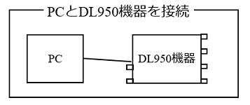

## 1_DL950機器との接続



### 1.1_接続の基本

- **visautils**パッケージを使って，DL950機器を制御するには，最初に，DL950機器と接続します．
- DL950機器と接続するには，USBケーブル接続とネットワーク接続の2種類があります．
- DL950機器とネットワーク接続するPythonスクリプトは，下記のようになります．但し，**xx.xx.xx.xx**の部分は，DL950機器に割り振ったIPアドレスとなります．

```python
from visautils import visaDL950

DL950 = visaDL950.visaDL950("TCPIP::xx.xx.xx.xx")
DL950.open()
```
- DL950機器とUSBケーブル接続するには，DL950機器のUSBケーブル接続の番号を調べる必要があります．WF1968機器のケースと異なり，DL950機器の本体からUSBケーブル接続する番号を調べる方法は，（調べた範囲では）マニュアルにも記載されていません．
- DL950機器とUSBケーブル接続する番号は，実際にDL950機器とUSB接続し，DL950機器の電源をONにした状態で，NI MAXアプリ（NI社製のアプリ）を実行して調べるか，下記のPythonスクリプトを実行して調べて下さい．

```python
import pyvisa

rm = pyvisa.ResourceManager()
visa_list = rm.list_resources()
for visa_resource in visa_list:
    print(visa_resource)
```

- DL950機器とUSB接続するケースでは，調べたUSB接続の番号を，ネットワーク接続のケースで置き換えて実行して下さい．

- DL950機器の個別の番号を調べて，上記のPythonスクリプトを作成したら，実行してみて下さい．エラーメッセージが表示されなければ，DL950機器と問題なく接続できています．


### 1.2_エラー処理を追加する

- DL950機器と接続するPythonスクリプトは，基本的には上記のコマンドのみでOKなのですが，接続できない時の処理を追加した方が良いでしょう．
- ためしに，DL950機器の電源をOFFにした状態で，上記のPythonスクリプトを実行してみて下さい．何やら，エラーメッセージが表示されると思います．これは，DL950機器に接続しようとしたが，接続出来なかったことを意味しています．

- visautilsパッケージでは，DL950機器と接続出来なかった時は，例外を発生します．Pythonでの例外処理を理解する必要はありません．下記に示すPythonスクリプトと同じ記述で，DL950機器と接続出来なかった時は，画面にメッセージを表示して，Pythonスクリプトの実行を終了することができます．

```python
imort sys
from visautils import visaDL950

try:
  DL950 = visaDL950.visaDL950("USB0::0x0B21::0x0077::xxxxxxxx::INSTR")
  DL950.open()
except:
    print("Can't connect to DL950\n")
    sys.exit(0)
```

### 1.3_ENV_DL950_RESNAME環境変数を使う

- 上記で紹介した方法は，DL950機器の接続番号をPythonスクリプトに直接記述する方法です．この方法だと，DL950機器を交換する毎に，該当する箇所を記述し直す必要が出てきます．また，複数のメンバーで，共通のPythonスクリプトを共有するケース（個人毎に別のDL950機器を使っているケース）でも，同様に，該当する箇所を記述し直す必要が出てきます．
- これに対し，**ENV_DL950_RESNAME**環境変数に，DL950機器の接続番号を設定しておき，Pythonスクリプト内では，接続番号の代わりに，このENV_DL950_RESNAME文字を記述することで，環境変数に設定されている接続番号を使うこともできます．

- 下記に示す，ENV_DL950_RESNAME環境変数を使う方法だと，DL950機器を交換しても（複数のメンバー毎に別のDL950機器を使うケースでも），環境変数の設定を変更するだけで，Pythonスクリプトは修正せずに，同じPythonスクリプトを使うことができます．

```python
from visautils import visaDL950

DL950 = visaDL950.visaDL950("ENV_DL950_REANAME")
DL950.open()
```