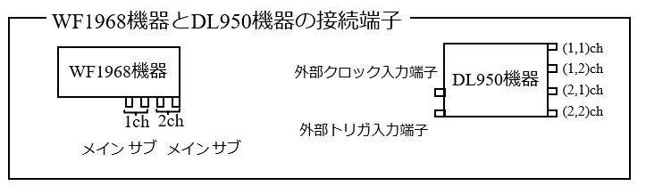
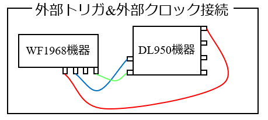

## 1_WF1968機器とDL950機器の接続端子と電圧信号の種類

- WF1968機器とDL950機器の2つの測定機器を，visautilsパッケージで制御するPythonスクリプトを紹介しますが，これら2台の測定機器を同軸ケーブルで接続する構成をポンチ図を使って表しています．
- WF1968機器とDL950機器の接続端子は，ポンチ図で以下のように記述しています．

- まず，WF1968機器は，本体右下に4つの同軸ケーブルの接続端子がありますが，左側の2個の接続端子が1チャネルのメインおよびサブチャネルです．右側の2個の接続端子が2チャネルのメインおよびサブチャネルです．
- 次に，DL950機器は，本体左側に，外部クロック入力端子（上側），外部トリガ入力端子（下側）があり，右側の上から順番に，装着モジュールのチャネル，(1,1)チャネル～(2,1)チャネルとなります．
- WF1968機器から送信する電圧信号は，1チャネルのメインチャネルから送信し，DL950機器との接続は赤線で示します．トリガ信号は2チャネルのサブチャネルから送信し，DL950機器との接続は緑線で示します．クロック信号は1チャネルのサブチャネルから送信し，DL950機器との接続は青線で示します．
- 下記の接続図では，WF1968機器の1メインチャネルから送信する電圧信号を，DL950機器の(1,1)チャネルで取り込み，1サブチャネルから送信するクロック信号を，DL950機器の外部クロック入力端子に接続し，2サブチャネルから送信するトリガ信号を，DL950機器の外部トリガ入力端子に接続した構成を示しています．

