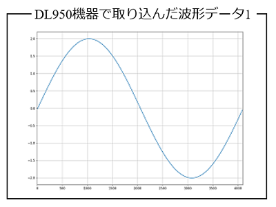
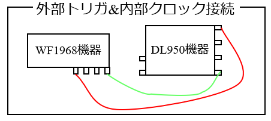
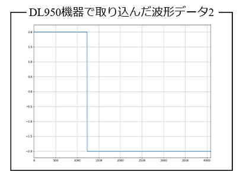

## 1_測定機器の配線

- WF1968機器とDL950機器を直接接続し，WF1968機器から送信する電圧信号をDL950機器と取込むことで，visautilsパッケージを使った測定装置の操作方法を紹介します．
- ここでは，WF1968機器から任意波形データを送信し，それを直接DL950機器で取込む，最も基本的なPythonスクリプトを紹介します．

### 1.1_外部トリガおよび外部クロック使用

- 下図に示す接続図のように，WF1968機器のサブチャネルから，外部トリガ信号と，外部クロック信号を送信し，DL950機器の外部トリガ端子と外部クロック端子で受信します．WF1968機器の1メインチャネルから正弦波の電圧信号を送信し，DL950機器の(1,1)チャネルで電圧波形データを取り込みます．


- 下記に，上記の接続で，WF1968機器から正弦波の任意波形データを送信し，DL950機器で波形データを取り込むPythonスクリプトを示します．

```python
from visautils import mesDevice, visaDL950, visaWF1968, waveData

freq       = 50.0
ndata      = 4096
ex_range   = 2
amp_gain   = 1
fg_tch     = 2
fg_clch    = 1
vch        = (1,1)
os_tch     = "EXT" 
os_clch    = "EXT"
average    = 20

WF1968 = visaWF1968.visaWF1968("ENV_WF1968_RESNAME")
WF1968.open()
DL950  = visaDL950.visaDL950("ENV_DL950_RESNAME")
DL950.open()

WF1968.reset()

funcgen = mesDevice.funcgen(freq, ndata, ex_range, amp_gain, fg_tch, fg_clch)
funcgen.initial_setting(WF1968)

vs = waveData.sinWaveData.data(ndata, 30) 
funcgen.send_arrayAW(vs)

oscillo = mesDevice.oscillo(freq, ndata, os_tch, os_clch, average=average)
chs = [vch, os_tch]
oscillo.initial_setting(DL950, chs)
chs = [vch]
vss = oscillo.capture_waves(chs)
```

- 下図は，DL950機器で取り込んだ波形データをグラフ化したものです．波形データは正しく取り込めていることが分かります．



### 1.2_外部トリガおよび内部クロック使用

- 上記のケースを少しばかり修正し，今度は，下記のようにしました．
    - 装着モジュールの(2,2)チャネルに外部トリガ信号を接続（**os_tch**変数に(2,2)タプルを設定）
    - DL950機器の内部クロックを使用（**os_clch**変数に"INT"を設定）
    - WF1968機器から方形波信号を送信




- 下記のPythonスクリプトでは，WF1968機器の1サブチャネルから，クロック信号を送信するように記述（**fg_clch**変数に1が設定してある）してありますが，DL950機器が内部クロックを使うように記述しているので，（たとえ1サブチャネルと外部クロック入力端子を接続していたとしても）無視されます．

```python
from visautils import mesDevice, visaDL950, visaWF1968, waveData

freq       = 50.0
ndata      = 4096
ex_range   = 2
amp_gain   = 1
fg_tch     = 2
fg_clch    = 1
vch        = (1,1)
os_tch     = (2,2) 
os_clch    = "INT"
average    = 20

WF1968 = visaWF1968.visaWF1968("ENV_WF1968_RESNAME")
WF1968.open()
DL950  = visaDL950.visaDL950("ENV_DL950_RESNAME")
DL950.open()

WF1968.reset()

funcgen = mesDevice.funcgen(freq, ndata, ex_range, amp_gain, fg_tch, fg_clch)
funcgen.initial_setting(WF1968)

vs = waveData.squareWaveData.data(ndata, 30) 
funcgen.send_arrayAW(vs)

oscillo = mesDevice.oscillo(freq, ndata, os_tch, os_clch, average=average)
chs = [vch, os_tch]
oscillo.initial_setting(DL950, chs)
chs = [vch]
vss = oscillo.capture_waves(chs)
```
- 取り込んだ波形データをグラフ化すると，方形波データが正しく取り込まれていることが分かります．

