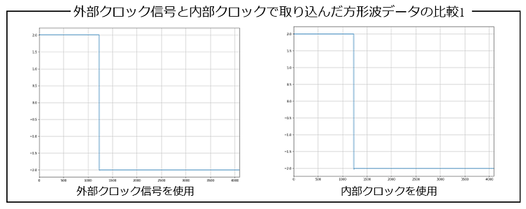
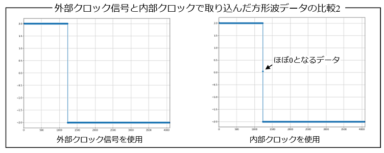

## 1_概要

- visautilsパッケージを使うと，WF1968機器のサブチャネルからクロック信号を送信することができ，これをDL950機器の外部クロック入力端子に接続することで，WF1968機器から送信する電圧信号と同じデータ数で，波形データを取り込むことができます．
- 一方，DL950機器の内部クロックを使っても，WF1968機器から送信する電圧信号と同じデータ数で波形データを取り込むことができます（visautilsパッケージの機能です）．
- 両者の違いを検証してみます．

### 1.1_方形波を使った検証

- 前回の，**01_任意波形データの送受信**で，DL950機器の内部クロックを使ったPythonスクリプトを紹介しましたが，これを検証に使います．

- 下図に示すように，WF1968機器の1サブチャネル（クロック信号を送信）をDL950機器の外部クロック入力端子に接続します．


- DL950機器の外部クロック信号を使った場合のPythonスクリプトを下記に示します（**os_clch**グローバル変数を，"INT"から"EXT"に変更しただけです）．

```python
from visautils import mesDevice, visaDL950, visaWF1968, waveData

freq       = 50.0
ndata      = 4096
ex_range   = 2
amp_gain   = 1
fg_tch     = 2
fg_clch    = 1
vch        = (1,1)
os_tch     = (2,2) 
os_clch    = "EXT"
average    = 20

WF1968 = visaWF1968.visaWF1968("ENV_WF1968_RESNAME")
WF1968.open()
DL950  = visaDL950.visaDL950("ENV_DL950_RESNAME")
DL950.open()

WF1968.reset()

funcgen = mesDevice.funcgen(freq, ndata, ex_range, amp_gain, fg_tch, fg_clch)
funcgen.initial_setting(WF1968)

vs = waveData.squareWaveData.data(ndata, 30) 
funcgen.send_arrayAW(vs)

oscillo = mesDevice.oscillo(freq, ndata, os_tch, os_clch, average=average)
chs = [vch, os_tch]
oscillo.initial_setting(DL950, chs)
chs = [vch]
vss = oscillo.capture_waves(chs)
```

### 1.2_取り込んだ方形波データの比較結果

- まず，取り込んだ方形波データの比較を下図に示します．
- 外部クロック信号を使用して波形データを取り込んだ結果も，内部クロックを使用して波形データを取り込んだ結果も，グラブ描画したものを比較するだけでは違いは無いように思えます．



- 但し，取り込んだ波形データの個別のデータを比較すると，両者は違いが生じます．
- 下記に，個別のデータを丸印で表したグラフを描画したものを示します．
- 内部クロックを使って波形データを取り込んだ場合，4096個のデータのうちの僅か1個のデータが，ほぼ0の値となっていることが分かります．これは，DL950機器の内部クロックを使って波形データを取り込むと，4096個ではなく，それを超える5000個の波形データとして一旦取り込み，そこから4096個の波形データを補間によって算出するため，場合によってこのようなデータが発生します．
- DL950機器のクロック信号の違いを顕著にするために，今回は，方形波を使って両者を比較しました．実際の測定データでは，ここまで顕著に差が生じることは稀で，実際には問題にはならないことが大半です．しかしながら，DL950機器の内部クロックを使って波形データを取り込むケースでは，補間による誤差が必ず生じることを気に留めておく必要があります．


