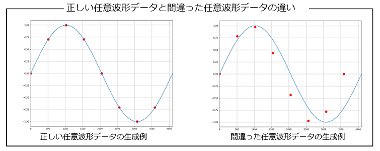
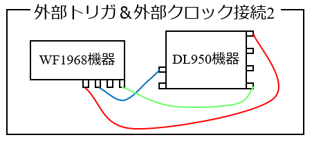
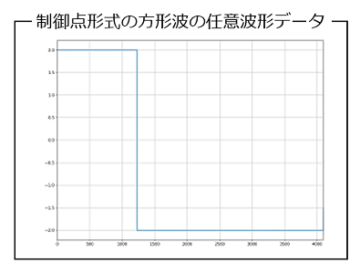

## 1_任意波形データの種類

- WF1968機器から送信する任意波形データは，下記に示す2種類の任意波形データが使えます．
    - 配列形式
    - 制御点形式
- **visautils**パッケージは，等間隔で電圧値のみのデータを指定する配列形式の他に，**制御点形式**の任意波形データを使うこともできます．
- 制御点形式の任意波形データの特徴は，下記のようになります．
    - 2～10000個の任意のデータ数
    - 横軸（時間）と縦軸（電圧）の値をデータとする
    - 時間の間隔は任意（等間隔でなくて良い）
- 一見，配列形式よりも（時間の間隔が任意の）制御点形式の方がメリットがあるように思えますが， 実際の測定において，WF1968機器から送信する電圧信号は複雑な波形になることが多く，時間刻みは等間隔とするのが自然です．また，WF1968機器に転送する波形データも，縦軸成分（電圧値）は2バイト（16bit）なのに対し，横軸成分（時間）は4バイト（32bit）と2倍のデータとなるので，配列形式のデータ数の1/3以下でないと，制御点形式はPCからWF1968機器に任意波形データを転送する時間は長くなってしまいます（WF1968機器はDL950機器と比べて波形データの転送時間が遅い）．
- ここでは，まず最初に，ユーザ自ら任意波形データを作成する手順を紹介し，次に，visautilsパッケージで制御点形式の任意波形データを使う方法を紹介します．

### 1.1_任意波形データを作成する上での注意点

- ユーザ自ら任意波形データを作成する上で，注意すべき点があります．
- ここで，正弦波の任意波形データを，numpy配列として生成するPythonスクリプトを例として説明します．

- 下記のPythonスクリプトは，1周期のデータ数が8個となる正弦波の任意波形データのnumpy配列を生成する例です．

```python
import numpy as np

ndata = 8

xs = np.linspace(0, 1, ndata, endpoint=False)
ts = 2*np.pi*xs
sin_wave = np.sin(ts)
```

- これに対し，下記のPythonスクリプトは，間違った正弦波の任意波形データのnumpy配列を生成する例です．

```python
import numpy as np

ndata = 8

xs = np.linspace(0, 1, ndata)
ts = 2*np.pi*xs
sin_wave = np.sin(ts)
```

- 上記2つのPythonスクリプトの違いが分かるでしょうか？
- 正しいPythonスクリプトは，**np.linspace**()関数で，**endpoint=False**の引数が指定されていますが，間違ったPythonスクリプトは，該当する引数がありません．
- np.linspace()関数のendpoint=False引数の指定は，最後の値を含む/含まないの指定です．上記の正しいPythonスクリプトの例では，xs変数に，0～1の間を8個の数値の配列を生成していますが，endpoint=False引数を指定することで，最後の値である**1**を含まない8個の数値の配列となります．
- 一方，間違ったPythonスクリプトの例では，xs変数に最後の値である1を含んだ8個の数値の配列を生成してしまいます．
- **1周期の波形データは次の周期の最初のデータは含めません**．上記の正弦波データの例では，角度0～2πの正弦波のデータであっても，最後の2πの角度は含めません．
- すると，最後の角度はどうなるのでしょうか？それは，任意波形データのデータ数によって決まります．

- 下記に，正しい任意波形データと間違った任意波形データの両者が，目標となる正弦波データと比べて，どのようになっているのかを示しています．うっかり，次の周期の最初のデータを含めてしまうと，所望の波形データとならないことが分かると思います．




## 2_制御点形式の任意波形データ

- 配列形式の任意波形データは，上記のPythonスクリプトで示したように，縦軸（電圧）のデータをnumpy配列として生成すれば良いです．
- ここでは，もう一方の任意波形データである，制御点形式の任意波形データの生成と，WF1968機器で制御点形式の任意波形データの送信方法に関して紹介します．

### 2.1_制御点形式の任意波形データの生成

- 制御点形式の任意波形データは，横軸（時間）と縦軸（電圧）のそれぞれをnumpy配列として生成します．
- ここでは，デューティ比30[%]の方形波データを，制御点形式で任意波形データを作成します．
- まず，デューティ比30[%]の方形波データということは，1周期の前半30[%]の振幅が1，残りが-1となる波形データということになります．
- 周波数が50[Hz]の場合，周期は20[ms]となるので，デューティ比30[%]は，時刻6[ms]までは振幅1，それ以降は振幅-1の波形データとすれば良いことになります．
- 問題は，任意波形データの最後のデータを，どう定義するかです．上記の注意点で紹介したように，任意波形データは次の周期の最初のデータを含めてはいけません．その直前のデータを最後のデータとすべきなのです．
- この場合，一つの指標となるのは，DL950機器で取込む波形データのデータ数です．例えば，DL950機器で取込む波形データのデータ数が4096個の場合，WF1968機器から送信する制御点形式の任意波形データの最後のデータは，時間で表すと，4095/4096周期[s]のデータとすれば良いことになります．
- 今までは，WF1968機器から送信する任意波形データのデータ数は，DL950機器で取込む波形データのデータ数と一致していたので，両者を**ndata**としていましたが，ここでは，WF1968機器から送信する任意波形データのデータ数を**fg_ndata**とすることにします．
- すると，制御点形式の任意波形データの生成は，下記のPythonスクリプトのようになります．numpy配列**ts**が横軸（時間），**vs**が縦軸（電圧）となります．

```python
import numpy as np

freq  = 50
ndata = 4096
duty  = 30

ts = np.zeros(fg_ndata, dtype=np.float64)
vs = np.zeros(fg_ndata, dtype=np.float64)
t1 = period*duty/100
t2 = t1 + 1.0/(freq*ndata)
t3 = period - 1.0/(freq*ndata)

ts[0] = 0.0
vs[0] = 1.0

ts[1] = t1
vs[1] = 1.0

ts[2] = t2
vs[2] = -1.0

ts[3] = t3
vs[3] = -1.0
```

### 2.2_制御点形式の任意波形データの送信

- visautilsパッケージでは，任意波形データはデフォルトで配列形式です．
- 制御点形式の任意波形データを送信するには，下記の手続きが異なります．
    - mesDeviceパッケージのfuncgenクラスインスタンスを生成する時に，**controlAW=True**引数を追加し，**cap_ndata**引数にDL950機器で取込む波形データのデータ数を設定する
    - 任意波形データは，**send_controlAW**()関数を使って送信する
- cap_ndata引数にDL950機器で取込む波形データのデータ数を設定するのは，WF1968機器から送信するクロック信号に必要なためです．通常は，WF1968機器から送信する電圧信号のデータ数 = DL950機器で取込む電圧波形のデータ数となるので，両者は一致するのですが，制御点形式の任意波形データでは，両者は必ずしも一致しないため，cap_ndata引数に，DL950機器で取込む波形データのデータ数を設定する必要があります．
- WF1968機器とDL950機器の接続は下記に示すように，WF1968機器のサブチャネルからトリガ信号とクロック信号を送信し，DL950機器の外部クロック端子と装着モジュールの(2,2)チャネルに接続します．




- 下記に，制御点形式の方形波データの任意波形データを生成し，WF1968機器から送信して，DL950機器で取込むPythonスクリプトの例を紹介します．

```python
import numpy as np
from visautils import mesDevice, visaDL950, visaWF1968

freq = 50
fg_ndata = 4
ndata    = 4096
ex_range = 2
amp_gain = 1
fg_tch   = 2
fg_clch  = 1
vch      = (1,1)
os_tch   = (2,2)
os_clch  = "EXT"
average  = 20

WF1968 = visaWF1968.visaWF1968("ENV_WF1968_RESNAME")
WF1968.open()
DL950  = visaDL950.visaDL950("ENV_DL950_RESNAME")
DL950.open()

period = 1/freq
WF1968.reset()

funcgen = mesDevice.funcgen(freq, fg_ndata, ex_range, amp_gain, fg_tch, fg_clch, controlAW=True, cap_ndata=ndata)
funcgen.initial_setting(WF1968)

(ts,vs) = control_square(period, 30)
funcgen.send_controlAW(ts, vs)

oscillo = mesDevice.oscillo(freq, ndata, os_tch, os_clch, average=average)
chs = [vch, os_tch]
oscillo.initial_setting(DL950, chs)

chs = [vch]
vss = oscillo.capture_waves(chs)

def control_square(period, duty):
    ts = np.zeros(fg_ndata, dtype=np.float64)
    vs = np.zeros(fg_ndata, dtype=np.float64)
    t1 = period*duty/100
    t2 = t1 + 1.0/(freq*ndata)
    t3 = period - 1.0/(freq*ndata)

    ts[0] = 0.0
    vs[0] = 1.0
    ts[1] = t1
    vs[1] = 1.0
    ts[2] = t2
    vs[2] = -1.0
    ts[3] = t3
    vs[3] = -.10

    return (ts, vs)
```

- 上記のPythonスクリプトを実行して，WF1968機器から送信した，制御点形式の方形波の任意波形データを，DL950機器で取り込んだものをグラフ描画した結果を下記に示します．
- WF1968機器から送信する任意波形データのデータ数と，DL950機器で取込む波形データのデータ数が異なっていても，正しく波形データを取り込めていることが確認出来ます．


