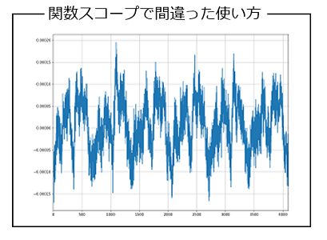
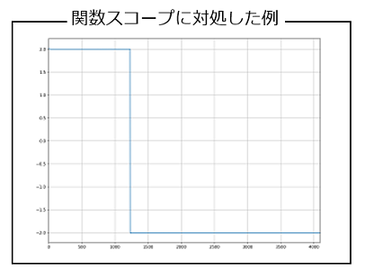

## 1_概要

- **visautils**パッケージは，Python言語から測定機器を制御するためのドライバで，ユーザ自ら，Pythonで作成したルーチンを追加して，より複雑な計測を行うことができます．
- その一方，思った通りに測定ができない症状が発生することがあります．もちろん，visautilsパッケージのバグが原因となる場合もありますが，それ以外に，間違いやすい使い方もあります．
- ここでは，visautilsパッケージを使って測定機器を制御する場合に，間違いやすい使い方と，その解決方法を紹介します．

## 2_関数スコープ

- 下記のPythonスクリプトは，**01_任意波形データの送受信**の，**1.2_外部トリガおよび内部クロック使用**で紹介したスクリプトを，修正したものです．

```python
from visautils import mesDevice, visaDL950, visaWF1968, waveData

freq       = 50.0
ndata      = 4096
ex_range   = 2
amp_gain   = 1
fg_tch     = 2
fg_clch    = 1
vch        = (1,1)
os_tch     = (2,2) 
os_clch    = "INT"
average    = 20

def send_wave(WF1968):
    WF1968.reset()
    funcgen = mesDevice.funcgen(freq, ndata, ex_range, amp_gain, fg_tch, fg_clch)
    funcgen.initial_setting(WF1968)
    vs  = waveData.squareWaveData.data(ndata, 30) 
    funcgen.send_arrayAW(vs)

def capture_wave(DL950):
    oscillo = mesDevice.oscillo(freq, ndata, os_tch, os_clch, average=average)
    chs = [vch, os_tch]
    oscillo.initial_setting(DL950, chs)
    chs = [vch]
    vss = oscillo.capture_waves(chs)

WF1968 = visaWF1968.visaWF1968("ENV_WF1968_RESNAME")
WF1968.open()
DL950  = visaDL950.visaDL950("ENV_DL950_RESNAME")
DL950.open()

send_wave(WF1968)
capture_wave(DL950)
```

- 今までは，WF1968機器で任意波形データを送信する箇所と，DL950機器で波形データを取り込む箇所を，全て1つのルーチンとして記述していましたが，上記は，それぞれの処理毎に関数を定義して，連続して呼び出すようにしています．
- Pythonスクリプトが長くなってくると，上記のように，個別の処理毎に関数を定義し，それらの関数を呼び出すように記述することは，スクリプトを保守する手間が軽減されるので非常に優れたやり方です．
- しかしながら，上記のPythonスクリプトを実行すると，取り込んだ波形データは下記のようになり，上手く波形データを取り込むことができません．一体，何が原因なのでしょうか？



- 上記のPythonスクリプトで，上手く波形データを取り込むことが出来なかった原因は，Pythonの関数スコープによるものです．
- Pythonの関数スコープとは，「関数内のローカル変数は関数を抜けると参照できない（無効になる）」ことです．
- つまり，**send_wave**()関数内で，生成した**funcgen**クラスインスタンスは，send_wave()関数を抜けることで無効になります．visautilsパッケージは，funcgenクラスインスタンスが無効になった時点で，出力中の電圧信号を停止する仕様となっています．これが原因で，上記のPythonスクリプトは上手く波形データを取り込むことができなかったのです．

- 上記のPythonスクリプトを訂正した例を，下記に示します．
- 訂正箇所は少なく，send_wave()関数およびcapture_wave()関数で，それぞれ，生成したfuncgenクラスインスタンスおよびoscilloクラスインスタンスを戻り値とし，それを変数funcgenおよびoscilloに代入しています．こうすることによって，関数内のローカル変数であったfuncgenクラスインスタンスおよびoscilloクラスインスタンスが，関数を終了しても（抜けても）値を保持した状態（有効な状態）を継続するので，WF1968機器から出力中の電圧信号は停止されません．
- **visautilsパッケージを使ってWF1968機器やDL950機器を制御する場合，生成したfuncgenクラスインスタンスおよびoscilloクラスインスタンスは，Pythonスクリプトで何かしらの変数に値を代入して保持した状態として下さい**.それぞれをグローバル変数としても良いです．
- 生成したfuncgenクラスインスタンスおよびoscilloクラスインスタンスが無効となった時点で，WF1968機器から出力中の電圧信号を停止したり，DL950機器で取り込み中の波形データを停止するのは，visautilsパッケージの仕様です．

```python
from visautils import mesDevice, visaDL950, visaWF1968, waveData

freq       = 50.0
ndata      = 4096
ex_range   = 2
amp_gain   = 1
fg_tch     = 2
fg_clch    = 1
vch        = (1,1)
os_tch     = (2,2) 
os_clch    = "INT"
average    = 20

def send_wave(WF1968):
    WF1968.reset()
    funcgen = mesDevice.funcgen(freq, ndata, ex_range, amp_gain, fg_tch, fg_clch)
    funcgen.initial_setting(WF1968)
    vs  = waveData.squareWaveData.data(ndata, 30) 
    funcgen.send_arrayAW(vs)
    return funcgen

def capture_wave(DL950):
    oscillo = mesDevice.oscillo(freq, ndata, os_tch, os_clch, average=average)
    chs = [vch, os_tch]
    oscillo.initial_setting(DL950, chs)
    chs = [vch]
    vss = oscillo.capture_waves(chs)
    return oscillo

WF1968 = visaWF1968.visaWF1968("ENV_WF1968_RESNAME")
WF1968.open()
DL950  = visaDL950.visaDL950("ENV_DL950_RESNAME")
DL950.open()

funcgen = send_wave(WF1968)
oscillo = capture_wave(DL950)
```

