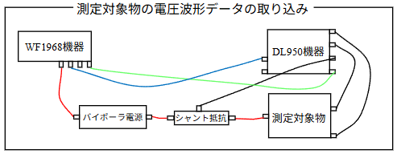
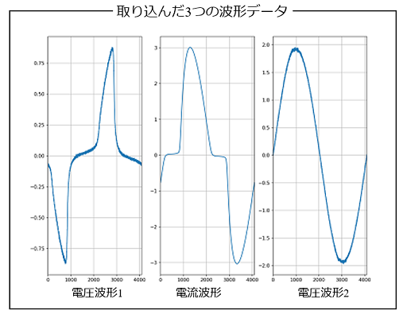

## 1_測定対象物を使った測定

- ここでは，visautilsパッケージを使って，測定対象物を使った測定を行うPythonスクリプトを紹介します．
- 取込む波形データは，下記の3つの波形データとなります．
    - 測定対象物の2つの電圧波形データE1およびE2
    - 測定対象物に流れる電流波形データ（シャント抵抗を利用）
- ここで，電流波形データは，シャント抵抗素子の両端の電圧波形からシャント抵抗値を用いて電流波形データに変換します（visautilsパッケージの機能です）．
- 測定対象物を含めた測定システム全体の接続図を下記に示します．WF1968機器からは外部クロック信号とトリガ信号をサブチャネルから送信し，DL950機器は，外部クロックおよび，装着モジュールの(2,2)チャネルにトリガ信号を接続しています．



- 上記のケースに対する，3つの波形データを取り込むPythonスクリプトを下記に示します．今回は，簡単のため，WF1968機器から送信する電圧信号は正弦波とします．
- WF1968機器から送信する電圧信号は，バイポーラ電源で増幅された後，シート抵抗を介して測定対象物に印加されます．バイポーラ電源の増幅利得は100倍とし，シート抵抗素子のシート抵抗は0.1[Ω]とします．

```python
from visautils import mesDevice, visaDL950, visaWF1968, waveData

freq       = 50.0
ndata      = 4096
ex_range   = 2
amp_gain   = 100
fg_tch     = 2
fg_clch    = 1
vch        = (1,1)
cch        = (2,1)
ech        = (1,2)
os_tch     = (2,2) 
os_clch    = "EXT"
shunt      = ((2,1), 0.1)
average    = 20

def send_capture_wave(WF1968, DL950):

    WF1968.reset()

    funcgen = mesDevice.funcgen(freq, ndata, ex_range, amp_gain, fg_tch, fg_clch)
    funcgen.initial_setting(WF1968)

    vs  = waveData.sinWaveData.data(ndata) 
    funcgen.send_arrayAW(vs)

    oscillo = mesDevice.oscillo(freq, ndata, os_tch, os_clch, shunt, average=average)
    chs = [vch, cch, ech, os_tch]
    oscillo.initial_setting(DL950, chs)
    chs = [vch, cch, ech]
    vss = oscillo.capture_waves(chs)
    return vss

WF1968 = visaWF1968.visaWF1968("ENV_WF1968_RESNAME")
WF1968.open()
DL950  = visaDL950.visaDL950("ENV_DL950_RESNAME")
DL950.open()

vss = send_capture_wave(WF1968, DL950)
vs0 = vss[0] # (1,1)チャネル接続の電圧波形データ
vs1 = vss[1] # (2,1)チャネル接続の電流波形データ
vs2 = vss[2] # (1,2)チャネル接続の電圧波形データ
```
- 今までのPythonスクリプトと，下記の点が異なります．
    - バイポーラ電源の増幅利得を，**amp_gain**変数の値として100を設定
    - シャント抵抗素子を使った電流波形データの取り込みに対し，oscilloクラスインスタンスの生成で，**shunt**値（シャント抵抗を介した電流波形データの取り込みチャネル番号とシャント抵抗値のタプル）を指定
    - oscilloクラスインスタンスのinitial_setting()関数およびcapture_wave()関数に，3つのチャネルを指定（initial_setting関数は，トリガ信号用のチャネルも含める）
    - capture_waves()関数の戻り値に，3つのチャネルに対して取り込んだ波形データがリストとして収納されている

- 下記に，取り込んだ3つの波形データを示します．電流波形データは，シート抵抗値を使って電圧信号から電流信号へ変換済みの波形データとなっています．

