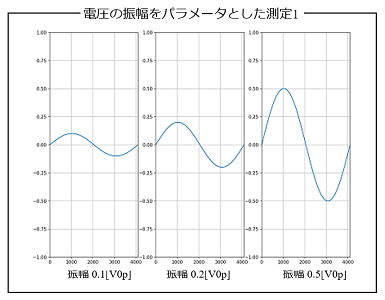
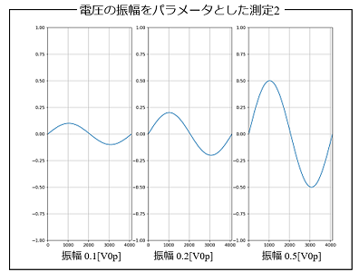
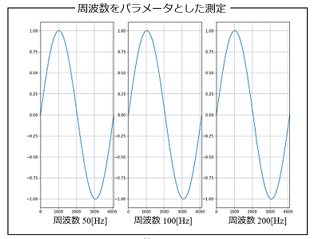

## 1_概要

- visautilsパッケージを使って，電圧の振幅値や周波数をパラメータとして測定を行うケースのPythonスクリプトを紹介します．
- 電圧の振幅値をパラメータとするケースは，それほど難しくありませんが，周波数をパラメータとするケースでは，WF1968機器から送信する電圧信号だけでなく，トリガ信号やクロック信号も変更した上で，さらに，DL950機器で波形データを取り込むための設定値も変更しなくてはならず，複雑になります．
- visautilsパッケージでは，周波数をパラメータとする測定でも，funcgenクラスインスタンスとoscilloクラスインスタンスの，それぞれの**set_frequency**()関数を使うことで，これらの複雑な処理を行うことができます．

- 電圧および周波数をパラメータとした測定は，下記に示す接続でWF1968機器から正弦波の任意波形データを送信し，DL950機器の(1,1)チャネルで取り込みました．WF1968機器は，サブチャネルからトリガ信号とクロック信号を送信し，DL950機器は，装着モジュールの(2,2)チャネルにトリガ信号，外部クロック信号端子にクロック信号を接続しています．


## 2_電圧の振幅値をパラメータとした測定

- 電圧の振幅値をパラメータとして測定を行う場合，下記の2つの方法が考えられます．
    1. 電圧レンジは固定したまま，振幅値を変更した任意波形データに切り替える
    2. 電圧レンジを変更し，任意波形データを切り替える

- いずれの方法を用いるにしても，**電圧信号を送信したまま振幅値を変更するのは問題があります**．電圧信号を送信したまま，何かしらの設定値を変更すると，送信中の電圧信号に（想定外のノイズなどの）影響を与える危険が高いので，振幅値を変更する際は，電圧信号の送信を一旦停止した状態で変更するのが良いでしょう．
- WF1968機器から電圧信号の送信を一旦停止するのは，**stop_signal**()関数を使います．

### 2.1_電圧レンジは固定したまま振幅値を変更した任意波形データに切り替える

- 下記の例では，電圧レンジを1.0[V0p]と固定したまま，振幅値を0.1, 0.2, 0.5[V0p]に変更した任意波形データに切り替えるPythonスクリプトを紹介します．

```python
from visautils import mesDevice, visaDL950, visaWF1968, waveData

freq       = 50.0
ndata      = 4096
ex_range   = 1
amp_gain   = 1
fg_tch     = 2
fg_clch    = 1
vch        = (1,1)
os_tch     = (2,2) 
os_clch    = "EXT"
average    = 20

def chg_arbitrary(WF1968, DL950):
    WF1968.reset()
    funcgen = mesDevice.funcgen(freq, ndata, ex_range, amp_gain, fg_tch, fg_clch)
    funcgen.initial_setting(WF1968)

    oscillo = mesDevice.oscillo(freq, ndata, os_tch, os_clch, average=average)
    chs = [vch, os_tch]
    oscillo.initial_setting(DL950, chs)

    vs_01 = 0.1*waveData.sinWaveData.data(ndata)
    vs_02 = 0.2*waveData.sinWaveData.data(ndata)
    vs_05 = 0.5*waveData.sinWaveData.data(ndata)

    chs = [vch]
    funcgen.send_arrayAW(vs_01)
    vss = oscillo.capture_waves(chs)
    wave_01 = vss[0]
    funcgen.stop_signal()

    funcgen.send_arrayAW(vs_02)
    vss = oscillo.capture_waves(chs)
    wave_02 = vss[0]
    funcgen.stop_signal()

    funcgen.send_arrayAW(vs_05)
    vss = oscillo.capture_waves(chs)
    wave_05 = vss[0]
    funcgen.stop_signal()

WF1968 = visaWF1968.visaWF1968("ENV_WF1968_RESNAME")
WF1968.open()
DL950  = visaDL950.visaDL950("ENV_DL950_RESNAME")
DL950.open()

chg_arbitrary(WF1968, DL950)
```
- 上記のPythonスクリプトを実行し，DL950機器で取り込んだwave_01～wave_05変数に収納された波形データをグラフ化したものを下記に示します．振幅値が0.1, 0.2, 0.5[V0p]となっていることが分かります．



### 2.2_電圧レンジと任意波形データの両方を変更して切り替える

- ここでは，任意波形データのみならず，WF1968機器の電圧レンジも変更するケースのPythonスクリプトを紹介します．但し，比較のため，任意波形データは同じ値のものを生成しています．
- WF1968機器の電圧レンジを変更するには，**set_ex_range**()関数を使います．注意すべき点は，ここで設定する電圧レンジの値は，バイポーラ電源で増幅後の電圧レンジ[V0p]の値です．今回は，バイポーラ電源を使わないので，WF1968機器の電圧レンジと同じ値となります（但し[Vpp]ではなく[V0p]値）
```python
```python
from visautils import mesDevice, visaDL950, visaWF1968, waveData

freq       = 50.0
ndata      = 4096
ex_range   = 1
amp_gain   = 1
fg_tch     = 2
fg_clch    = 1
vch        = (1,1)
os_tch     = (2,2) 
os_clch    = "EXT"
average    = 20

def chg_amplitude(WF1968, DL950):

    WF1968.reset()
    funcgen = mesDevice.funcgen(freq, ndata, ex_range, amp_gain, fg_tch, fg_clch)
    funcgen.initial_setting(WF1968)

    oscillo = mesDevice.oscillo(freq, ndata, os_tch, os_clch, average=average)
    chs = [vch, os_tch]
    oscillo.initial_setting(DL950, chs)

    vs_01 = waveData.sinWaveData.data(ndata)
    vs_02 = waveData.sinWaveData.data(ndata)
    vs_05 = waveData.sinWaveData.data(ndata)

    chs = [vch]

    funcgen.set_ex_range(0.1)
    funcgen.send_arrayAW(vs_01)
    vss = oscillo.capture_waves(chs)
    wave_01 = vss[0]
    funcgen.stop_signal()

    funcgen.set_ex_range(0.2)
    funcgen.send_arrayAW(vs_02)
    vss = oscillo.capture_waves(chs)
    wave_02 = vss[0]
    funcgen.stop_signal()

    funcgen.set_ex_range(0.5)
    funcgen.send_arrayAW(vs_05)
    vss = oscillo.capture_waves(chs)
    wave_05 = vss[0]
    funcgen.stop_signal()

WF1968 = visaWF1968.visaWF1968("ENV_WF1968_RESNAME")
WF1968.open()
DL950  = visaDL950.visaDL950("ENV_DL950_RESNAME")
DL950.open()

chg_amplitude(WF1968, DL950)
```
- 上記のPythonスクリプトを実行し，DL950機器で取り込んだwave_01～wave_05変数に収納された波形データをグラフ化したものを下記に示します．振幅値が0.1, 0.2, 0.5[V0p]となっていることが分かります．



## 3_周波数をパラメータとした測定
- ここでは，周波数をパラメータとして測定を行うケースのPythonスクリプトを紹介します．
- WF1968機器とDL950機器の接続は，上記と同じく，WF1968機器のサブチャネルからトリガ信号とクロック信号を送信し，DL950機器の外部クロック信号端子と装着モジュールの(2,2)チャネルに接続します．
- 電圧の振幅値を変更するケースと同様に，周波数を変更する際にはWF1968機器からの電圧信号の送信を**stop_signal**()関数で停止した状態で行って下さい．
- まず，WF1968機器側は，**set_frequency**()関数を使って周波数を再設定した後に，send_arrayAW()関数を使って任意波形データを送信して下さい．
- 次に，DL950機器側は，同じく**set_frequency**()関数を使って周波数を再設定した後に，**capture_waves**()関数を使って波形データを取り込んで下さい．

```python
from visautils import mesDevice, visaDL950, visaWF1968, waveData

freq       = 50.0
ndata      = 4096
ex_range   = 1
amp_gain   = 1
fg_tch     = 2
fg_clch    = 1
vch        = (1,1)
os_tch     = (2,2) 
os_clch    = "EXT"
average    = 20

def chg_frequency(WF1968, DL950):
    WF1968.reset()
    funcgen = mesDevice.funcgen(freq, ndata, ex_range, amp_gain, fg_tch, fg_clch)
    funcgen.initial_setting(WF1968)

    oscillo = mesDevice.oscillo(freq, ndata, os_tch, os_clch, average=average)
    chs = [vch, os_tch]
    oscillo.initial_setting(DL950, chs)

    vs = waveData.sinWaveData.data(ndata)

    chs = [vch]
    funcgen.set_frequency(50)
    funcgen.send_arrayAW(vs)
    oscillo.set_frequency(50)
    vss = oscillo.capture_waves(chs)
    wave_50 = vss[0]
    funcgen.stop_signal()

    funcgen.set_frequency(100)
    funcgen.send_arrayAW(vs)
    oscillo.set_frequency(100)
    vss = oscillo.capture_waves(chs)
    wave_100 = vss[0]
    funcgen.stop_signal()

    funcgen.set_frequency(200)
    funcgen.send_arrayAW(vs)
    oscillo.set_frequency(200)
    vss = oscillo.capture_waves(chs)
    wave_200 = vss[0]
    funcgen.stop_signal()

WF1968 = visaWF1968.visaWF1968("ENV_WF1968_RESNAME")
WF1968.open()
DL950  = visaDL950.visaDL950("ENV_DL950_RESNAME")
DL950.open()

chg_frequency(WF1968, DL950)
```
- 上記のPythonスクリプトは，周波数50, 100, 200[Hz]の正弦波データの送信および取り込みを実行しています．取り込んだ3つの波形データのグラフを下記に示します．問題なく波形データは取り込まれていることが分かります．


